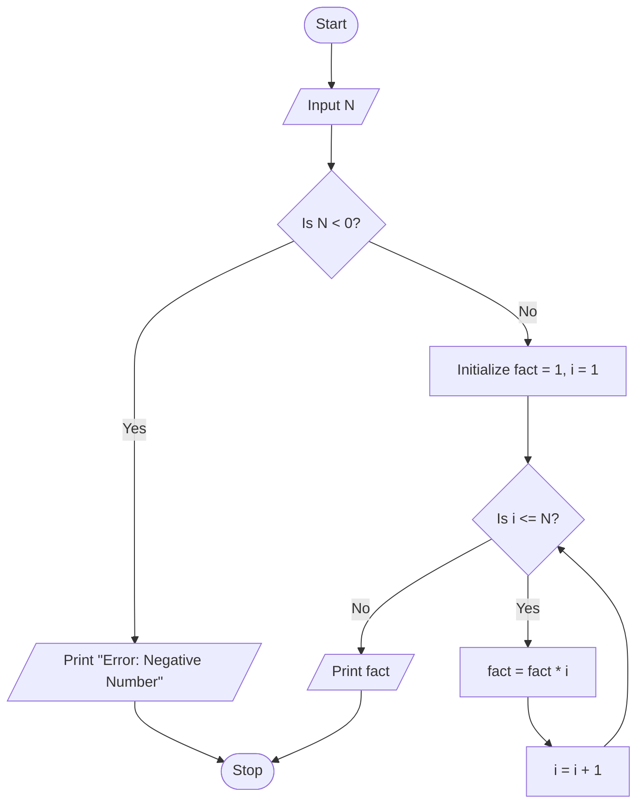

# Factorial of a Number

## Flowchart



## Pseudo Code

```text
BEGIN
    DECLARE variables N, fact, i
    INPUT N
    
    IF N < 0 THEN
        PRINT "Factorial is not defined for negative numbers"
    ELSE
        SET fact = 1
        SET i = 1
        
        WHILE i <= N DO
            fact = fact * i
            i = i + 1
        ENDWHILE
        
        PRINT "Factorial of ", N, " is ", fact
    ENDIF
END
```
